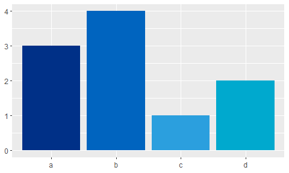
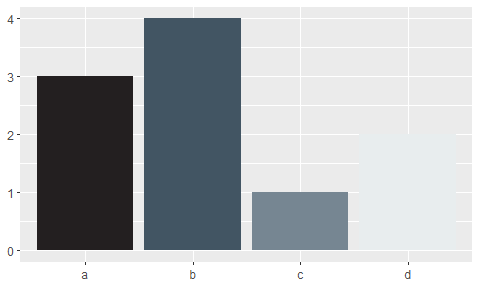
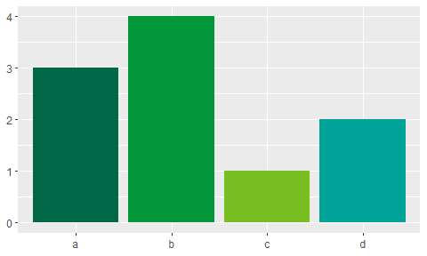

<!-- README.md is generated from README.Rmd. Please edit that file -->

# NHS-R Theme <a alt="NHS-R Community's logo" href="https://nhsrcommunity.com/"></a>

<!-- badges: start -->

[](https://github.com/nhs-r-community/NHSRtheme/actions)
<!-- badges: end -->

This repo attempts to build an R package that can provide themes to
ggplot for producing charts that follow the [NHS
Identity](https://www.england.nhs.uk/nhsidentity/).

# Installing NHSRtheme

`{NHSRtheme}` is not currently on CRAN, so you will have to install it
directly from Github using devtools.

If you do not have the devtools package installed, you will have to run
the first line in the code below as well.

``` r
# install.packages('devtools')
devtools::install_github('nhs-r-community/NHSRtheme')
```

## Examples

``` r
library(ggplot2)
library(NHSRtheme)
df <- data.frame(x = c("a", "b", "c", "d"), y = c(3, 4, 1, 2))
bars <- ggplot(df, aes(x, y, fill = x)) + 
    geom_bar(stat = "identity") + 
    labs(x = NULL, y = NULL) +
    theme(legend.position = "none")
```

``` r
bars + scale_fill_nhs()
```

<!-- -->

``` r
bars + scale_fill_nhs(palette = 'blues')
```

<!-- -->

``` r
bars + scale_fill_nhs(palette = 'neutrals') 
```

<!-- -->

``` r
bars + scale_fill_nhs(palette = 'support greens')
```

<!-- -->

``` r
df2 <- data.frame(x = c("a", "b", "c", "d", "e", "f" ,"g", "h"), 
                  y = c(3, 4, 1, 2, 5, 9, 7, 4))

bars2 <- ggplot(df2, aes(x, y, fill = x)) + 
    geom_bar(stat = "identity") + 
    labs(x = NULL, y = NULL) +
    theme(legend.position = "none")

bars2 + scale_fill_nhs(palette = 'highlights')
```

<!-- -->
